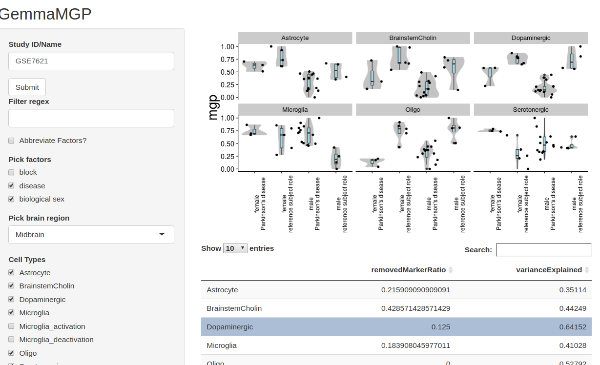

gemmaMPG
--------

[This](https://pavlab.shinyapps.io/gemmaMGP/) is a shiny app that calculates and visualizes [marker gene profiles](https://github.com/PavlidisLab/markerGeneProfile) of arbitrary datasets from [Gemma](https://gemma.msl.ubc.ca/home.html). It also returns calculate some quality metrics for the estimation.

